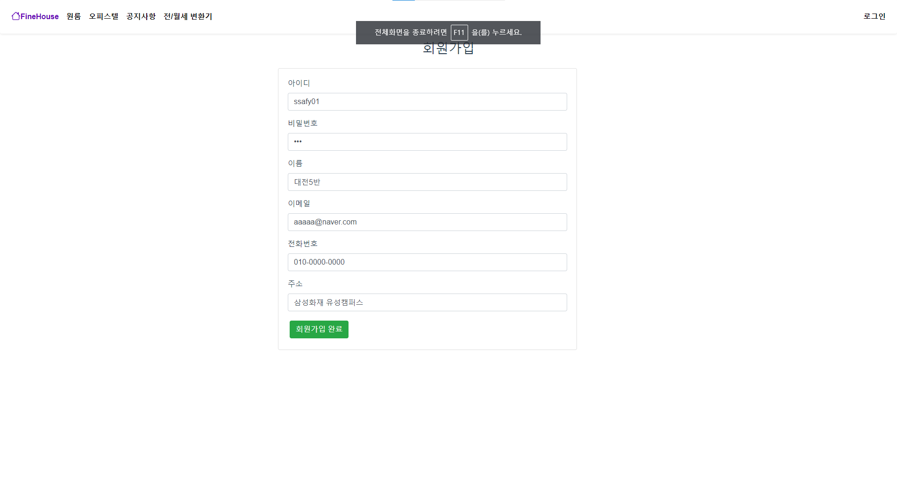
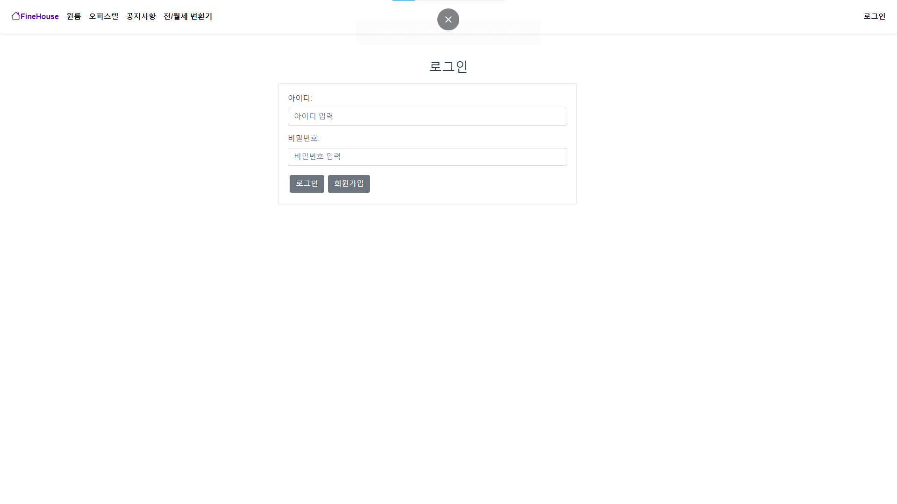
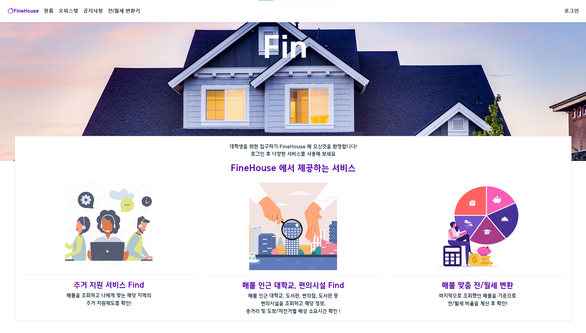
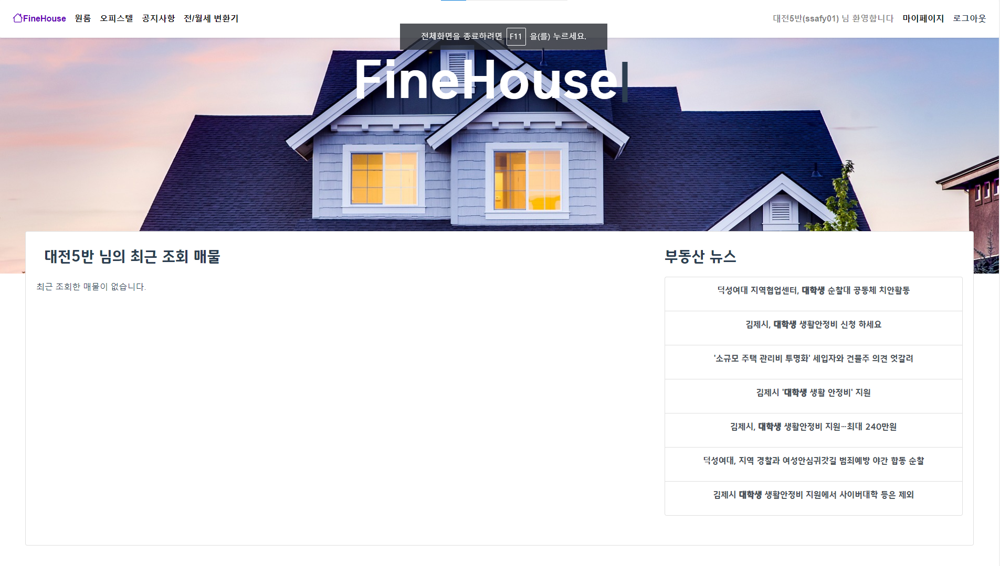
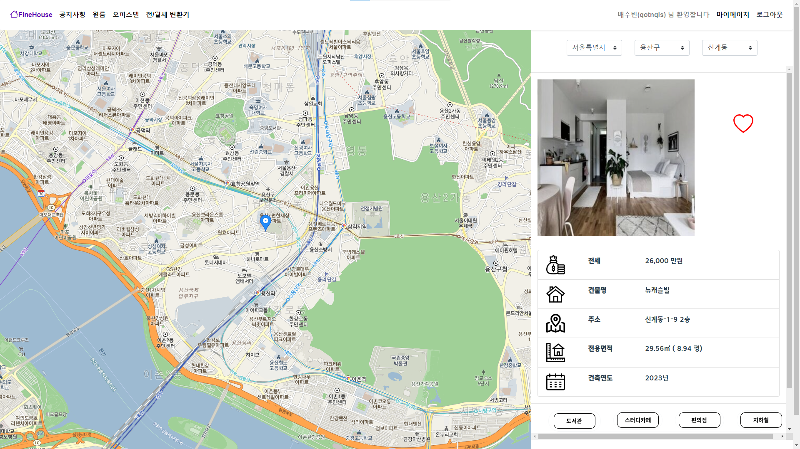
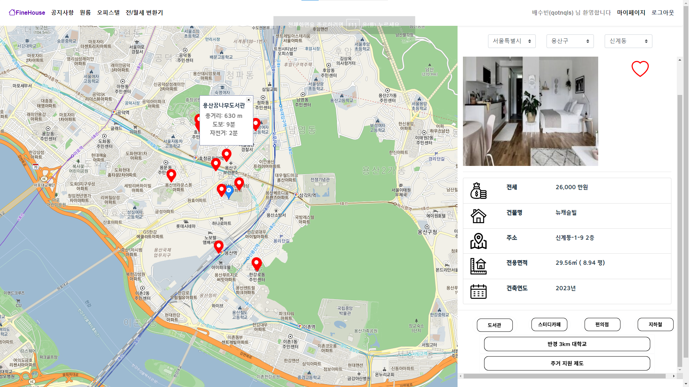
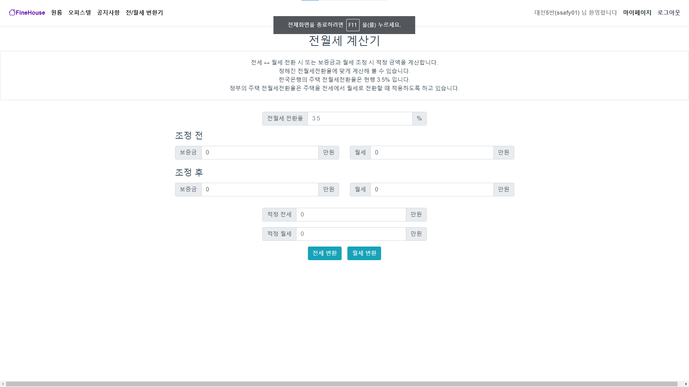
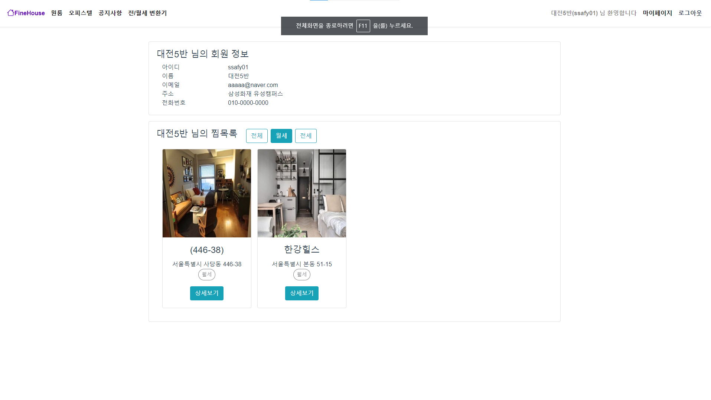

# 🏠 FineHouse: 부동산 전월세 검색 서비스
개발 기간 : 23.03 ~ 23.04

## 🌟 프로젝트 소개

**본 프로젝트는 대학생을 대상으로 전월세 매물 및 주변 시설을 검색하여 최상의 조건에서 집을 구할 수 있도록 도와줍니다.**

**FineHouse**는 크게 다음과 같은 기능을 지원합니다
1. 전월세 등 다양한 집 형태의 매물 조회 제공
2. 해당 집 주변 시설 제공
3. 전/월세 변환기 제공
   

## 시작 가이드
### 요구사항
버전에 맞는 환경이 필요합니다.

FE
|사용기술| 버전 |
|-|-|
|Vue.js|2|
|Node.js|18.16.1|

BE
|사용기술|버전|
|-|-|
| Java | 11 |
| Springboot | 2.7.14 |
| gradle | 8.1.1 |
| Lombok | 1.18.24 |

## 🛠️ 사용 기술
### Environment

  
  
  

### Config

### Development
#### - Back-End

#### - Front-End
    

### Management & Communication

## 🖥️ 화면 구성

### 로그인화면

- 회원가입 

- 로그인

### 메인화면
- 메인

### 전월세 조회
- 집 상세 보기

- 주변 시설 확인

### 전/월세 변환기
- 보증금/월세에 따른 변환기

### 마이페이지
- 찜한 집 조회

## 📋 아키텍쳐
=======

### 메인화면

### 화상채팅 화면

### 친구/채팅 화면

### 관리자) 로그 확인 화면

### 관리자) 신고 확인 화면

### 정보 수정 화면

### FAQ 화면

### 1:1문의 화면

### 화상채팅 초대 화면

### 로그아웃 화면

## 아키텍쳐

### FLOW

### ERD

## 🤝 팀 소개

|||
|-|-|
|팀장 우수인 Full-Stack @wbo1026
|팀원 배수빈 Full-Stack @qotnqls1998
|

